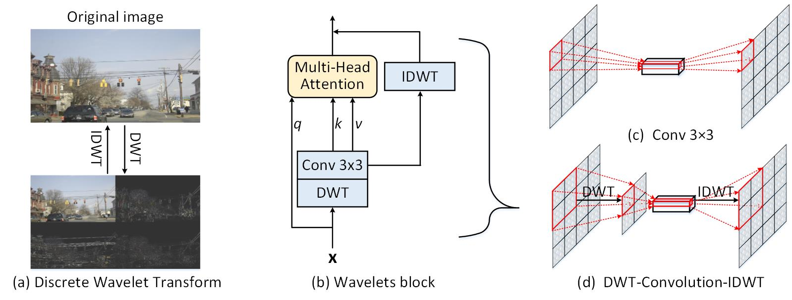
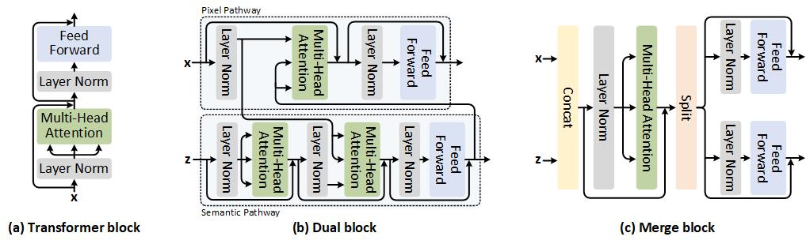

# Introduction
This repository contains the official implementation of the following papers:
- <a href="https://github.com/JDAI-CV/CoTNet/blob/master/README.md">**CoTNet**</a> Contextual transformer networks for visual recognition, TPAMI 2022
  <p align="center">
    
  </p>

- <a href="classification">**Wave-ViT**</a> Wave-ViT: Unifying Wavelet and Transformers for Visual Representation Learning, ECCV 2022
  <p align="center">
    
  </p>

- <a href="classification">**Dual-ViT**</a> Dual Vision Transformer
  <p align="center">
    
  </p>

# Getting Started
- For **Image Classification**, please see [classification](classification).
- For **Object Detection and Instance Segmentation**, please see [object_detection](object_detection).
- For **Semantic Segmentation**, please see [semantic_segmentation](semantic_segmentation).

# Citation
CoTNet
```
@article{cotnet2022,
  title={Contextual transformer networks for visual recognition},
  author={Li, Yehao and Yao, Ting and Pan, Yingwei and Mei, Tao},
  journal={IEEE Transactions on Pattern Analysis and Machine Intelligence},
  year={2022},
  publisher={IEEE}
}
```

Wave-ViT
```
@inproceedings{wavevit2022,
    title     = {Wave-ViT: Unifying Wavelet and Transformers for Visual Representation Learning},
    author    = {Yao, Ting and Pan, Yingwei and Li, Yehao and Ngo, Chong-Wah and Mei, Tao},
    booktitle = {Proceedings of the European conference on computer vision (ECCV)},
    year      = {2022},
}
```

Dual-ViT
```
@article{dualvit2022,
  title={Dual Vision Transformer},
  author={Yao, Ting and Li, Yehao and Pan, Yingwei and Wang, Yu and Mei, Tao},
  journal={arXiv preprint arXiv:},
  year={2022}
}
```

# Acknowledgements
Thanks the contribution of [timm](https://github.com/rwightman/pytorch-image-models), [pvt](https://github.com/whai362/PVT) and [volo](https://github.com/sail-sg/volo).
